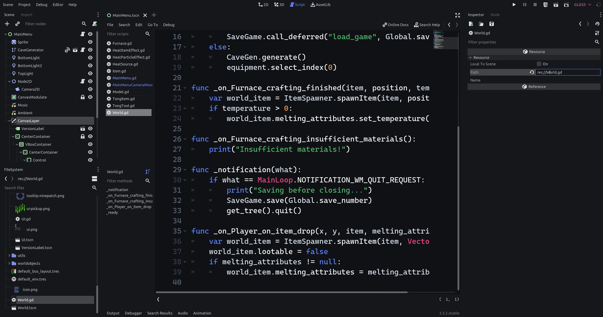

:waxing_crescent_moon: Dark vibrant theme for [Godot Engine](https://godotengine.org) used by [bitbrain in his devlogs](https://youtube.com/bitbraindev).

---




> **Disclaimer** As of Godot 3.x, it is still difficult to extract custom editor themes. Therefore, the installation might be currently a bit tricky for some people.

# How to install

1. Download the latest version of this project [here](https://github.com/bitbrain/godot-dash/archive/refs/heads/main.zip) and unzip it.
2. [Download Ubuntu Regular and Bold](https://fonts.google.com/specimen/Ubuntu) (.ttf) and move it into a folder of your choosing. This will be the Interface font for Godot.
3. [Download Cascadia Code font](https://github.com/microsoft/cascadia-code/releases) and move it into a folder of your choosing. This font will be the code editor font.
4. Head into your installation folder of Godot Engine (for example `C:\Program Files (x86)\Steam\steamapps\common\Godot Engine`) and edit the file `editor_data/editor_settings-3.tres`
5. Copy the contents of editor_settings-3.tres provided in the previously downloaded folder into that file
   * Alternatively you can copy the settings from the file editor_settings-themeonly.tres. This file only has settings that touch theming related properties and is intended for existing installations of Godot where other properties might be already changed. Place these settings under the \[resource\] group
6. Head into your editor_settings-3.tres file and modify the following lines to match the absolute paths of your previously downloaded fonts:
    ```
    interface/editor/main_font = "ABSOLUTE_PATH_TO_ YOUR_FONT/Ubuntu-R.ttf"
    interface/editor/main_font_bold = "ABSOLUTE_PATH_TO_ YOUR_FONT/Ubuntu-B.ttf"
    interface/editor/code_font = "ABSOLUTE_PATH_TO_ YOUR_FONT/CascadiaMono.ttf"
    ```

# Contribution

If you want to make changes to this font feel free to either fork it or adjust colours manually. However, the colours of this theme are fixed and will not change anytime soon.

For Godot 4 we will be hopefully able to export our own Editor themes. Until then, you will mostly rely on the instructions above. If you have any ideas how to speed up the setup process feel free to raise a pull request!

-Miguel :hearts: