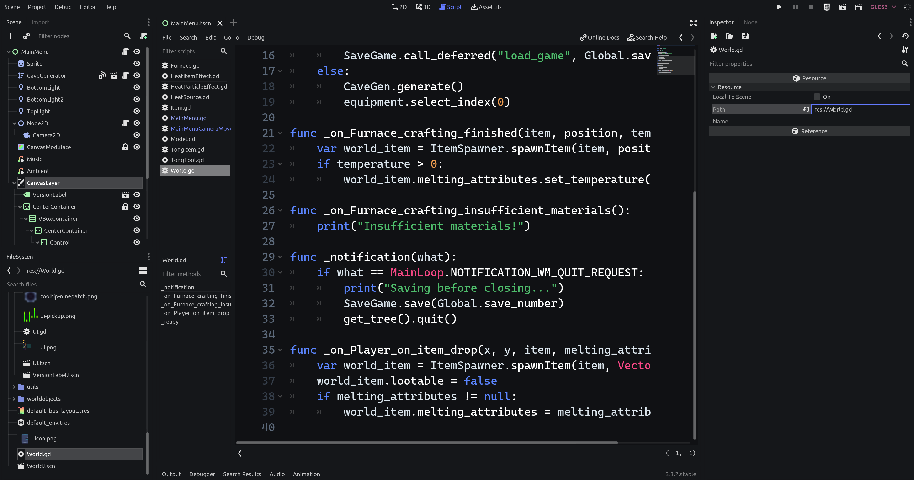
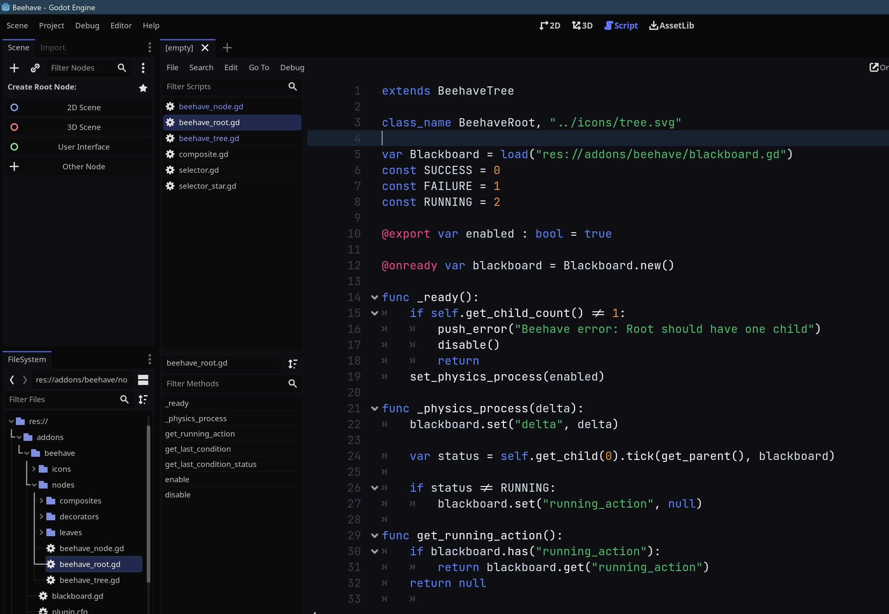

> PROJECT HAS BEEN MOVED TO `tangled.org`: https://tangled.org/bitbra.in/godot-dash


:waxing_crescent_moon: Dark vibrant theme for [Godot Engine](https://godotengine.org) used by [bitbrain in his devlogs](https://youtube.com/bitbraindev).

---
## Godot 3

## Godot 4



> **Disclaimer** As of Godot 3.x, it is still difficult to extract custom editor themes. Therefore, the installation might be currently a bit tricky for some people.

# How to install (Godot 3)

## Windows
1. Download the latest version of this project [for Godot 3](https://github.com/bitbrain/godot-dash/archive/refs/heads/godot-3.x.zip) and unzip it.
2. [Download Ubuntu Regular and Bold](https://fonts.google.com/specimen/Ubuntu) (.ttf) and move it into a folder of your choosing. This will be the Interface font for Godot.
3. [Download Cascadia Code font](https://github.com/microsoft/cascadia-code/releases) and move it into a folder of your choosing. This font will be the code editor font.
4. Head into your installation folder of Godot Engine (for example `C:\Program Files (x86)\Steam\steamapps\common\Godot Engine`) and edit the file `editor_data/editor_settings-3.tres` 
5. Copy the contents of editor_settings-3.tres provided in the previously downloaded folder into that file
   * Alternatively you can copy the settings from the file editor_settings-themeonly.tres. This file only has settings that touch theming related properties and is intended for existing installations of Godot where other properties might be already changed. Place these settings under the \[resource\] group
6. Head into your editor_settings-3.tres file and modify the following lines to match the absolute paths of your previously downloaded fonts:
    ```
    interface/editor/main_font = "ABSOLUTE_PATH_TO_ YOUR_FONT/Ubuntu-R.ttf"
    interface/editor/main_font_bold = "ABSOLUTE_PATH_TO_ YOUR_FONT/Ubuntu-B.ttf"
    interface/editor/code_font = "ABSOLUTE_PATH_TO_ YOUR_FONT/CascadiaMono.ttf"
    ```

## Linux

1. Open terminal.

2. Install fonts with a package manager, **or**:

2. Download the fonts and copy them to ~/.local/share/fonts/
    * [Download Ubuntu Regular and Bold](https://fonts.google.com/specimen/Ubuntu) (.ttf) and move it into a folder of your choosing. This will be the Interface font for Godot.
    * [Download Cascadia Code font](https://github.com/microsoft/cascadia-code/releases) and move it into a folder of your choosing. This font will be the code editor font.

3. `git clone https://github.com/bitbrain/godot-dash`

4. `cd godot-dash`

5. `cp editor_settings-3.tres $HOME/.config/godot`


# How to install (Godot 4.6 / 4.7+)

Godot 4.6+ stores editor settings in a versioned file (`editor_settings-4.7.tres` for 4.7), moved font keys under `interface/editor/fonts/`, and replaced `interface/theme/preset` with `interface/theme/color_preset`. The script editor also loads `.tet` files from `text_editor_themes/`.

Steam installs are self-contained: settings live next to the binary in `editor_data/`, not in `~/.config/godot`.

## Windows
1. Download the latest version of this project [here](https://github.com/bitbrain/godot-dash/archive/refs/heads/main.zip) and unzip it.
2. [Download Ubuntu Regular and Bold](https://fonts.google.com/specimen/Ubuntu) (.ttf) and move it into a folder of your choosing. This will be the Interface font for Godot.
3. [Download Cascadia Code font](https://github.com/microsoft/cascadia-code/releases) and move it into a folder of your choosing. This font will be the code editor font.
4. Head into your Godot data folder (Steam: `C:\Program Files (x86)\Steam\steamapps\common\Godot Engine\editor_data`) and copy `GodotDash.tet` into `text_editor_themes/`.
5. Edit `editor_settings-4.7.tres` (or `editor_settings-4.6.tres` on 4.6). Merge the keys from `editor_settings-4.7-themeonly.tres` under the `[resource]` group instead of replacing the whole file.
6. Point the font keys at your downloaded files:
    ```
    interface/editor/fonts/main_font = "ABSOLUTE_PATH_TO_YOUR_FONT/Ubuntu-Regular.ttf"
    interface/editor/fonts/main_font_bold = "ABSOLUTE_PATH_TO_YOUR_FONT/Ubuntu-Bold.ttf"
    interface/editor/fonts/code_font = "ABSOLUTE_PATH_TO_YOUR_FONT/CascadiaMono.ttf"
    ```
7. Restart the editor. Editor Settings → Interface → Theme should show **Color Preset: Custom**, and Text Editor → Theme should list **GodotDash**.

## Linux

1. Install fonts with a package manager, **or** copy them to `~/.local/share/fonts/`:
    * [Ubuntu Regular and Bold](https://fonts.google.com/specimen/Ubuntu)
    * [Cascadia Code](https://github.com/microsoft/cascadia-code/releases)

2. `git clone https://github.com/bitbrain/godot-dash && cd godot-dash`

3. Steam (self-contained):
    ```
    EDITOR_DATA="$HOME/.local/share/Steam/steamapps/common/Godot Engine/editor_data"
    cp GodotDash.tet "$EDITOR_DATA/text_editor_themes/"
    ```
    Then merge `editor_settings-4.7-themeonly.tres` into `$EDITOR_DATA/editor_settings-4.7.tres` and set the font paths.

4. Non-Steam: copy `GodotDash.tet` to `$HOME/.config/godot/text_editor_themes/` and merge the 4.7 theme-only keys into `$HOME/.config/godot/editor_settings-4.7.tres`.

# How to install (Godot 4.0–4.5)

Use `editor_settings-4.tres` / `editor_settings-4-themeonly.tres` and the older font keys (`interface/editor/main_font`, `interface/theme/preset`). Settings file is `editor_settings-4.tres`.

## Windows
1. Download the latest version of this project [here](https://github.com/bitbrain/godot-dash/archive/refs/heads/main.zip) and unzip it.
2. [Download Ubuntu Regular and Bold](https://fonts.google.com/specimen/Ubuntu) (.ttf) and move it into a folder of your choosing. This will be the Interface font for Godot.
3. [Download Cascadia Code font](https://github.com/microsoft/cascadia-code/releases) and move it into a folder of your choosing. This font will be the code editor font.
4. Head into your installation folder of Godot Engine (for example `C:\Program Files (x86)\Steam\steamapps\common\Godot Engine`) and edit the file `editor_data/editor_settings-4.tres`
5. Copy the contents of editor_settings-4.tres provided in the previously downloaded folder into that file
   * Alternatively you can copy the settings from the file editor_settings-4-themeonly.tres. This file only has settings that touch theming related properties and is intended for existing installations of Godot where other properties might be already changed. Place these settings under the \[resource\] group
6. Head into your editor_settings-4.tres file and modify the following lines to match the absolute paths of your previously downloaded fonts:
    ```
    interface/editor/main_font = "ABSOLUTE_PATH_TO_ YOUR_FONT/Ubuntu-R.ttf"
    interface/editor/main_font_bold = "ABSOLUTE_PATH_TO_ YOUR_FONT/Ubuntu-B.ttf"
    interface/editor/code_font = "ABSOLUTE_PATH_TO_ YOUR_FONT/CascadiaMono.ttf"
    ```

## Linux

1. Open terminal.

2. Install fonts with a package manager, **or**:

2. Download the fonts and copy them to ~/.local/share/fonts/
    * [Download Ubuntu Regular and Bold](https://fonts.google.com/specimen/Ubuntu) (.ttf) and move it into a folder of your choosing. This will be the Interface font for Godot.
    * [Download Cascadia Code font](https://github.com/microsoft/cascadia-code/releases) and move it into a folder of your choosing. This font will be the code editor font.

3. `git clone https://github.com/bitbrain/godot-dash`

4. `cd godot-dash`

5. `cp editor_settings-4.tres $HOME/.config/godot`


# Contribution

If you want to make changes to this font feel free to either fork it or adjust colours manually. However, the colours of this theme are fixed and will not change anytime soon.

On Godot 4.6+ the code theme lives in `GodotDash.tet`. UI colors still have to be merged into editor settings until Godot can export a full editor theme.

-Miguel :hearts:
